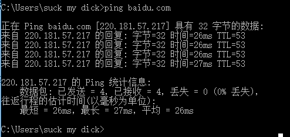
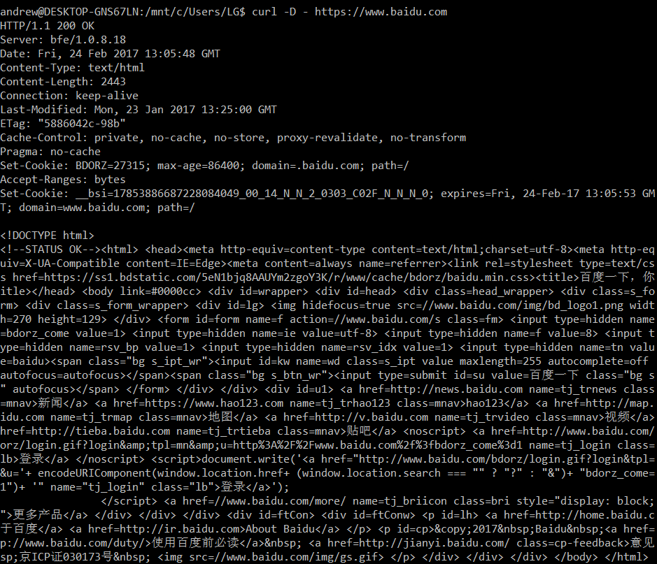

# HTTP基础

HTTP：Hyper Text Transfer Protocol:超文本传输协议

## 服务器

定义：一个管理资源并为用户提供服务的机器。
服务器在硬件和软件上都与个人PC不同。
硬件：具有较高的计算能力，能够提供给多个用户使用。需要7X24小时的连续工作，更稳定。
软件：服务器软件工作在客户端-服务器或浏览器-服务器的方式，有很多形式的服务器，比如：网页服务器，文件服务器。

## DNS

网域名称系统（Domain Name System）是互联网的一项服务。作用是将域名和IP地址相互映射的一个分布式数据库。
比如我们通常访问一个网站的时候，是在浏览器的地址栏里输入网址，当我们在输入baidu.com这个网址的时候，浏览器会向域名服务器去查找有没有这条记录。我们用ping可以返回网址的IP

我们直接输入图中的220.181.57.217（各地区有所不同）这个IP地址也是可以访问的。因为IP地址是很难记住的，所以网址可以让我们更好的记住并访问。
一个网址可以对应多个IP，同样的一个IP可以对应多个网址。

## 端口

端口是服务器启动服务的时候所占用的端口，依照互联网传输层TCP/IP协议不同的协议通信，都有不同的对应端口。一个端口对应一个服务。
0-1023为保留端口。
常用的端口：
- 21：FTP
- 53：DNS
- 80：HTTP
- 443：HTTPS
- 1080：SOCKS代理

## 请求&响应

客户端向服务器发送请求，服务器接收到请求之后给客户端响应客户端所需要的内容。

### 分析请求


一个浏览器的请求
```
GET /index.html HTTP/1.1
Host: 101.200.33.143:9999
Connection: keep-alive
Pragma: no-cache
Cache-Control: no-cache
Upgrade-Insecure-Requests: 1
User-Agent: Mozilla/5.0 (Macintosh; Intel Mac OS X 10_12_3) AppleWebKit/537.36 (KHTML, like Gecko) Chrome/56.0.2924.87 Safari/537.36
Accept: text/html,application/xhtml+xml,application/xml;q=0.9,image/webp,*/*;q=0.8
Accept-Encoding: gzip, deflate, sdch
Accept-Language: en-US,en;q=0.8,zh-CN;q=0.6,zh;q=0.4,zh-TW;q=0.2
Content-Type: application/x-www-form-urlencoded
```

请求主要分为四个部分：
第一部分：请求行 `GET /index.html HTTP/1.1` 动词  URL 协议版本/版本号
第二部分：请求头(请求头部有很多个)
			Host: 1.2.3.4
			Accept: html, xhtml, xml
			User-agent: Chrome / Mac
			定义第四部分格式：application/x-www-form-urlencoded
第三部分：回车
第四部分：消息体。比如username=xxxx&passwd=yyyy


### 分析响应

响应头对应请求头也有四部分：
第一部分：状态行：      协议  状态码  状态描述
第二部分：响应头：
				Content-type: text/html; charset=utf-8
				Server: bfe/1.0.8.18
				Date: Fri, 24 Feb 2017 13:05:48 GMT

第三部分：回车
第四部分：消息体
				<!DOCTYPE html>
				<html>
				......
				</html>

在命令行中使用 `curl -I` 或 `curl --head` 获取响应头

`curl -D -` 可以获取到响应头和响应体


#### 常见状态码

| 状态码  |         英文含义          |                   中文含义                   |
| :--: | :-------------------: | :--------------------------------------: |
| 200  |          OK           |       请求已成功，请求所希望的响应头或数据体将随此响应返回。        |
| 301  |   Moved Permanently   | 被请求的资源已永久移动到新位置，并且将来任何对此资源的引用都应该使用本响应返回的若干个URI之一。 |
| 302  |         Found         |          请求的资源现在临时从不同的URI响应请求。           |
| 304  |     Not Modified      | 如果客户端发送了一个带条件的GET请求且该请求已被允许，而文档的内容（自上次访问以来或者根据请求的条件）并没有改变，则服务器应当返回这个状态码。 |
| 403  |       Forbidden       |            服务器已经理解请求，但是拒绝执行它。            |
| 414  | Request-URI Too Long  |  请求的URI长度超过了服务器能够解释的长度，因此服务器拒绝对该请求提供服务。  |
| 500  | Internal Server Error |     服务器遇到了一个未曾预料的状况，导致了它无法完成对请求的处理。      |
| 502  |      Bad Gateway      |  作为网关或者代理工作的服务器尝试执行请求时，从上游服务器接收到无效的响应。   |

#### HTTP请求方法

|   动词    |                    含义                    |
| :-----: | :--------------------------------------: |
|  POST   | POST方法用于将实体提交到指定的资源，通常导致状态或服务器上的副作用的更改.  |
| DELETE  | DELETE方法删除指定的资源。PUT方法用请求有效载荷替换目标资源的所有当前表示。 |
|   PUT   |        PUT方法用请求有效载荷替换目标资源的所有当前表示。        |
|  PATCH  |           PATCH方法用于对资源应用部分修改。            |
|   GET   | GET方法请求一个指定资源的表示形式. 使用GET的请求应该只被用于获取数据.  |
|  HEAD   |     HEAD方法请求一个与GET请求的响应相同的响应，但没有响应体.     |
|  TRACE  |       TRACE方法沿着到目标资源的路径执行一个消息环回测试。       |
| OPTIONS |         OPTIONS方法用于描述目标资源的通信选项。          |
| CONNECT |      CONNECT方法建立一个到由目标资源标识的服务器的隧道。       |

## Cookie是什么

简单来说，cookie就是浏览器存储在用户电脑上的一小段文本文件。
1.浏览器访问服务器后，服务器传给浏览器的一段数据。
2.浏览器需要保存这段数据，不得轻易删除。
3.此后每次浏览器访问该服务器，都必须带上这段数据。

cookie一般有两个作用。
第一个作用是识别用户身份。
第二个作用是记录历史。