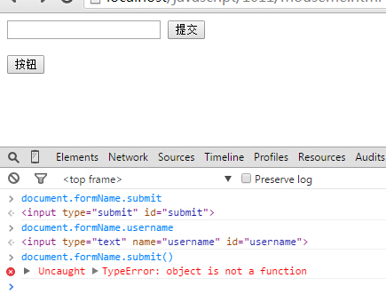

# 表单提交与阻止默认动作

假设有以下简单的表单，来看看提交与阻止提交那些事儿：
```HTML
<form action="aa.php" method="post" name="formName" id="formId">
    <input type="text" name="username">
    <input type="submit" id="input-submit">
</form>
<br/>
<input type="button" value="按钮" id="button">
```
要提交表单，需要表单内的一个type为”submit”或者”image”的input，但在html5年代，表单元素可以写在form表单外边，给它添加form属性值为对应form表单的id即可，比如上边的input#input-submit可以写到外边，就是
```HTML
<input type=”submit” id=”input-submit” form=”formId”>
```

但为了兼容IE8等久时代浏览器，还是写里边为好。
其实要把表单提交，只要form里边有获得焦点的文本框，按下Enter键就会提交，即使没有任何input[type=”submit”]之类。这样显然不人性化易误触，会通过监听keydown事件防止提交。而且很多人都不知道还能这样子提交，所以一般都给出提交按钮。
有提交功能的input[type=”submit”]不说了，如何让点击其他没有提交功能的按钮也提交呢？可以通过form表单的submit()方法来实现。首先要选择到这个form，除了常规的byId，byClassName等，以下两种可能用得不多：
```HTML
var form = document.formName;
var form = document.forms[0];
```

这两种方法也是可以获得表单的。有了表单执行submit()方法即可提交。这里有个小问题需要注意一下，为何我上边的input[type=”submit”]的id要写”input-submit”不写”submit”完事？这也郁闷一阵才发现，假如为username加上id为username，提交按钮的id改为submit：


如果存在id为”submit”的子元素，会将document.formName.submit看成一个dom对象，对象非方法，就报错了！所以如果需要js主动提交，表单内不应该有id为submit的元素。
有提交就有阻止提交，尤其需要进行表单验证的时候，下面说说我知道的方法。

```JavaScript
<script type="text/javascript">
var ID = function(id){return document.getElementById(id)};
var addEvent = function(elem, type, func){
    if(elem.addEventListener){
        elem.addEventListener(type, func, false);
        return true;
    }else if(elem.attachEvent){
        var r = elem.attachEvent("on"+type, func);
        return r;
    }else{
        elem["on"+type] = func;
    }
}
 
//1、使用submit按钮来提交，在提交按钮上作文章
addEvent(ID("input-submit"), "click", function(e){
    var event = e || window.event;
    console.log(event);
    // return false;//IE8可行，Chrome,Firefox不行
    // event.returnValue = false;//IE8,Chrome可行，Firefox不行
    event.preventDefault();//IE8不行，Chrome,Firefox可行
});
 
//2、使用submit按钮来提交，通过DOM2级事件监听onsubmit
addEvent(ID("formId"), "submit", function(e){
    var event = e || window.event;
    console.log(event);
    //结论同上
});
 
//3、使用submit按钮来提交，通过DOM0级事件监听onsubmit
//在form上添加onsubmit，<form ... onsubmit="return checkForm()" ...>
//注意不能只写checkForm()，需要return这个函数的返回值
function checkForm(){
//do something validation...
return false;//只需return false，全面通杀！
}
 
//4、不使用传统submit按钮而使用form.submit()方法主动提交
addEvent(ID("button"), "click", function(e){
var event = e || window.event;
if(...){//something validation...
    document.formName.submit();
}else{
    //不提交当然就“阻止”了，全通杀！
}
})
</script>
```

以上，感觉后两种比较easy…在方法4中，可能有人只做form.submit()这件事而把验证放到3的onsubmit事件中进行，注意这样是不行的，使用form.submit()提交时不会有onsubmit事件的触发！只有通过传统submit按钮提交才会有onsubmit事件触发。
方法1，2中是使用了阻止默认动作的方法，可以看到reutrn false，event.returnValue=false，event.preventDefault()三种办法兼容性不太一样，但总有一个有效！除了阻止表单提交用到，其他常见的还有比如阻止checkbox被选，阻止a链接跳转等等，如果不需要任何判断直接需要阻止，最简单的还是DOM0级添加onclick=”return false”。


> [原文链接](http://www.xiaomlove.com/2014/12/25/%E8%A1%A8%E5%8D%95%E6%8F%90%E4%BA%A4%E4%B8%8E%E9%98%BB%E6%AD%A2%E9%BB%98%E8%AE%A4%E5%8A%A8%E4%BD%9C/)


### onsubmit

### addEventListener

### window.load
http://www.softwhy.com/forum.php?mod=viewthread&tid=6191

### preventDefault


