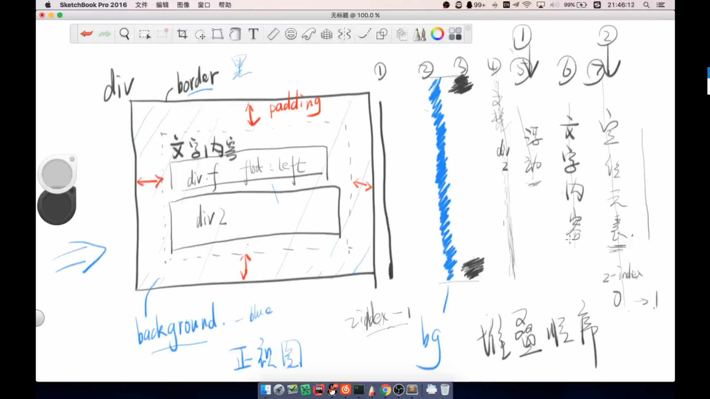

高度是出bug的根源

1. 内联
   padding，margin能改变宽度，不能改变高度。
    line-hight,font-size可以更改高度
2. 块级

宽度：1.爸爸的内容区域的宽度 - 自己的左右边框 - 自己的左右margin，auto 2.white-space控制是否换行
高度：内部的文档流中元素的高度的总和

3. inline block

宽：1.可以设置，2.内容决定宽度，3.white-space控制是否换行
高：1.可以设置 ，line-height，font-size，文档流中元素的高度总和

4. display table
5. display list item
6. display flex

## 居中
### 水平
1. 内联

父元素 text-align

2. 块级

 - 宽度固定，margin-left: auto; margin-right: auto

### 垂直

1. 内联

 2. 父元素line-hight
 3. 上下padding
 4. 父元素line-height和padding

5. 块级元素

父元素padding

**所有脱离文档流的元素都是块级元素。**

border盖住了background-color

浮动元素在文档流中的div和文字的中间。绝对定位元素在文字上方。
定位元素在z-index里面竞争。
堆叠顺序

绝对定位：

top: 50%; left:50%;margin-left: - 宽度/2; margin-top: - 高度/2
top: 50%; left:50%;transform: translate(50%,50%)

兼容性最好：
table垂直居中
